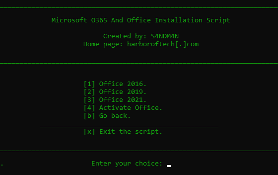
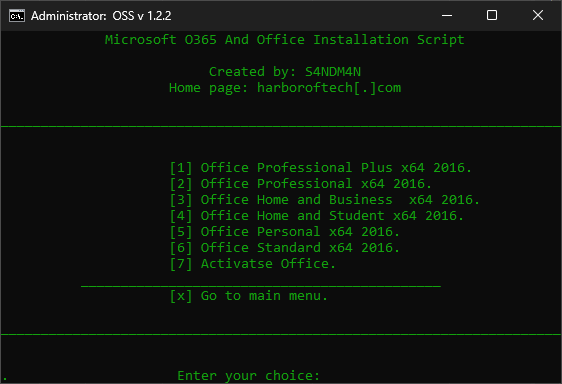
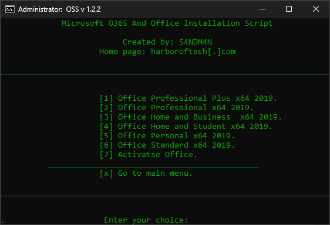
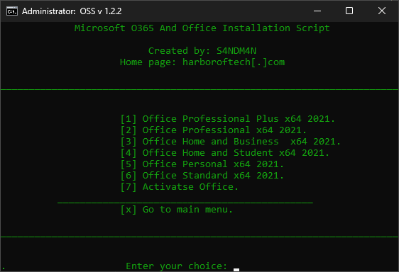
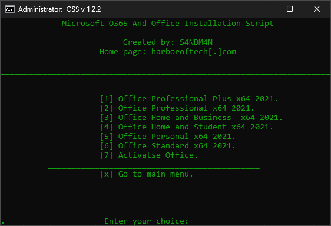

# Office Setup Script (OSS)

This script helps the user to download and install the latest version of Microsoft Office. It also provides a way to activate the Office license.

## How To Download
```
git clone https://github.com/s4ndm4n82/officesetupscript.git
cd officesetupscript
```
## How To Run
#### Command Prompt
```
oss.cmd
```
#### PowerShell
```
Invoke-Expression -Command "<path\of your\download\location>\File.bat"

// or

Start-Process -FilePath "<path\of your\download\location>\File.bat"
```

## How To Use The Script
1. Download the script and run it.
2. Select what version you want to download.
3. Select the product type from the selection page. Ex: Office Professional Plus 2016 x64.
4. Then wait till the installation process ends.
5. If you have a legitimate office license you can use that to activate your product without using the included activation script.
6. If you just want to test it out use the activation script to activate your product.

## Screenshots
* Start Menu <br/>


* Selection Page Office 2016 <br/>


* Selection Page Office 2019 <br/>


* Selection Page Office 2021 <br/>


* Selection Page Office 365 <br/>


* Selection Page Project 2021 <br/>


* Selection Page Visio 2021 <br/>
