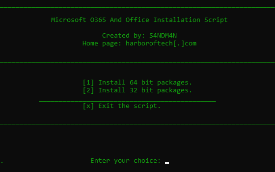

# Office Setup Script (OSS)

This script helps the user to download and install the latest version of Microsoft Office. It also provides a way to activate the Office license.

## Screenshots
* Start menu  

* Selection of Office  
